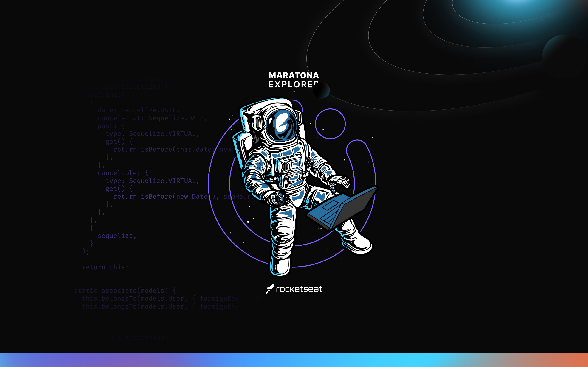

# Maratona Explorer 3.0

A Rocketseat disponibiliza um evento para se fazer parte de uma comunidade de futuros devs que estão, juntos, em busca de se desenvolver e alcançar seus maiores objetivos profissionais na Maratona Explore 3.0.




# Índice 🚀

## [Aula 01: O início da jornada](#o-início-da-jornada)

* [Fundamentos  da programação](#fundamentos-da-programação)
* [Front-end e Back-end](#front-end-e-back-end)
* [HTML](#html)
* [Código HTML](#código-html)

## [Aula 02: Descomplicando o código](#descomplicando-o-código)

* [CSS](#css)
* [Comentários](#comentários)
* [Cascading](#cascading)
* [Specificity](#specificity)
* [Box Model](#box-model)
* [Código CSS](#código-css)

## [Aula 03: Como acelerar sua evolução](#como-acelerar-sua-evolução)

* [VS Code](#vs-code)
* [Github](#github)
* [Netlify](#netlify)
* [Geradores de Qr code](#geradores-de-qrcode)
* [Código final da aula](#código-final-da-aula)


---
---

#  [O início da jornada](#aula-01-o-início-da-jornada)

Nessa aula você vai conhecer as possibilidades de atuar na programação e aprender os fundamentos e principais conceitos de HTML pra colocar a mão na massa e começar a desenvolver o seu site.

## Fundamentos  da programação

```markdown

## O que é programação?

Programação nada mais é do que ensinar o computador

---
## Ensinar o computador

- Algoritmos

  Sequência de passos, conjunto de regras

- Lógica de programação

  Maneira de pensar

- Sintaxe

  Maneira correta de escrever
```

## Front-end e Back-end

```markdown

## É uma comunicação

Imagina uma farmácia onde você vai pedir um remédio para o atendimento

---
## Cliente x Servidor

- Cliente

  Navegador (browser)

- Servidor

  Computador em algum lugar do mundo que tem os códigos

- Troca de dados

  Cliente faz o pedido e Servidor escuta e responde ao pedido.

- Cliente é o front-end, servidor é o back-end

---
## Tecnologias Front-end

- HTML

  Linguagem de marcação de texto para estrutura os textos, criar links, imagens, etc...

- CSS

  Linguagem de estilo para deixar o HTML bonito

- JavaScript

  Linguagem de programação que funciona no Navegador

---
## Tecnologias Back-end

- NodeJS

  Rodar o JavaScript no computador

- SQL

  Banco de dados para proteger os dados do seu programa
```

## HTML

```markdown
## O que é HTML?

- Estruturar textos, criar links, imagens, vídeo, etc ...

- Hypertext Markup Language

  Linguagem de marcação de texto

---

## Hypertext

- Hiper texto

- Texto que contém links

---

## Markup

- Marcação do texto

- Elemento HTML ou tag

  Existem inúmeras tags e cada uma deles irá servir para um determinado propósito. Ex.: imagem, texto grande, link, parágrafo, etc...

---

## Sintaxe de uma tag

sinal de menor, nome da tag, sinal de maior, conteúdo, sinal de menor, barra, nome da tag, sinal de maior

```html
<p>conteúdo</p>
```

---

## Atributos

- Adicionam informações e configurações à uma tag

- Sintaxe

  nome do atributo, sinal de igual, aspas duplas (abre), valor, aspas duplas (fecha)

```html
<a href="#">link</a>
```

---

## Comentários

- Ignorar linhas de código

- Adicionar informação

- Somente acessível por quem coda

```html
<!-- Aqui vem um comentário -->
<!--
Várias linhas de código 
poderão ser ignoradas 
ao utilizar comentário
-->
```

## [Código HTML](#o-início-da-jornada)

```html

<!DOCTYPE html>
<html lang="pt-br">
  <head>
    <meta charset="UTF-8">
    <meta name="viewport" content="width=device-width, initial-scale=1.0">
    <title>RocketCoffee</title>
  </head>

  <body>

    <header>
      <h1>RocketCoffee</h1>
      <p>Aberto todos os dias. 8h-21h</p>
    </header>

    <section>
      <h2>Brunch</h2>

      <ul>
        <li>
          <div class="details">
            <h3>Waffle Doce</h3>
            <p class="description">
              Lorem ipsum dolor sit amet consectetur adipisicing elit. 
            </p>
          </div>

          <strong class="price">
            R$37.70
          </strong>
        </li>

        <li>
          <div class="details">
            <h3>Massa Doce</h3>
            <p class="description">
              Lorem ipsum dolor sit amet consectetur adipisicing elit. 
            </p>
          </div>

          <strong class="price">
            R$17.70
          </strong>
        </li>

      </ul>
    </section>

  </body>
</html>

```

---
---

# [Descomplicando o código](#aula-02-descomplicando-o-código)

Nessa aula vamos continuar a construção do nosso projeto e dar uma cara para ele. Você vai conhecer as vantagens de construir um projeto e os pilares pra construir sua jornada na programação

## CSS

```markdown
## O que é CSS?

- Apresentação visual para o cliente

- Estilos para o HTML

- Cascading Style Sheets

Folha de Estilo em Cascata

---

## Declaration

- Declaração

  Pedaço de código que irá ditar as propriedades e valores a serem 
aplicadas a um elemento HTML

- Sintaxe

  Seletor, chave (abre), propriedade, dois pontos, valor, ponto vírgula, 
chave (fecha)

```css
body {
  background: red;
}
```

---

## Comentários

- Ignorar parte do código

- Adicionar informações que serão visíveis somente pra quem coda

```css
/* Essa linha será ignorada */

/*
Poderemos ignorar várias 
linhas de código
dessa forma
*/
```

---

## Cascading

- Cascata

  Quando há 2 (ou mais) declarações a última será mais relevante

```css
body {
  background: red;
}

body {
  background: blue;
}
```

---

## Specificity

Especificidade: Cada seletor tem um peso e a soma dos pesos, será levada 
em conta para que determinada declaração seja mais específica

```css
#id {
  /* peso 100 */
}

.class {
  /* peso 10 */
}

element {
  /* peso 1 */
}
```

> A cascata perde prioridade e é priorizada a especificidade da declaração

---

## Box Model

- Tudo são caixas

  Todos os elementos HTML serão considerados uma caixa, assim como uma 
caixa de papelão

- Caixas possuem determinadas propriedades, veja

  Conteúdo, Largura, Altura, Borda, Preenchimento (espaço interno), 
Espaçamento (espaço externo)

---

## [Código CSS](#descomplicando-o-código)

```css

/* GLOBAL */
* {
  margin: 0;
  padding: 0;
}

body {
  background-color: #FFEDD5; /* hex: 0-F */
}

ul {
  list-style: none;
}

/* HEADER */
header {
  padding: 32px 0;
  text-align: center;
}

header,
section {
  max-width: 300px;
  margin: 0 auto;
}

header h1 {
  margin-bottom: 4px;
}

header h1 span {
  color: #995000;
}

/* SECTION */
section {
  margin-bottom: 24px;
}

section h2 {
  background-color: #FED7AA;
  padding: 8px 16px;
  text-align: center;

  margin-bottom: 24px;
}

/* LISTA */
ul li {
  margin-bottom: 16px;
  display: flex;
}

li .details {
  max-width: 240px;
}

.details h3 {
  margin-bottom: 8px;
}

```

---
---

# [Como acelerar sua evolução](#aula-03-como-acelerar-sua-evolução)

Nessa aula vamos dar os toques finais e colocar nosso site no mundo. Com o projeto em mãos você estará um passo mais próximo do mercado da programação e vai conhecer quais os próximos passos da sua jornada.

## VS Code

Editor de código profissional. 

[Visual Studio Code - Code Editing. Redefined](https://code.visualstudio.com/)

Usar online

[https://vscode.dev](https://vscode.dev/)

## Github

```markdown
## O Que é?

- Plataforma online para colocar seus códigos

- Trabalha com o Git

  Versionamento de código

- Trabalhar em diversos projetos e times de código

- Perfil para mostrar seu trabalho (portfólio)
```

## Netlify

Plataforma de hospedagem de projetos e criação de links para outras pessoas acessarem.

[Netlify: Develop & deploy the best web experiences in record time](https://www.netlify.com/)

## Geradores de QRCode

[https://br.qr-code-generator.com/](https://br.qr-code-generator.com/)

[https://qr.io/](https://qr.io/)

[QR Code Generator (the-qrcode-generator.com)](https://www.the-qrcode-generator.com/) (não precisa criar conta)

---

## [Código final da aula](#como-acelerar-sua-evolução)

[https://github.com/maykbrito/maratona-explorer-3](https://github.com/maykbrito/maratona-explorer-3)

~~~html
<!DOCTYPE html>
<html lang="pt-br">
  <head>

    <link rel="preconnect" href="https://fonts.googleapis.com"> 
    <link rel="preconnect" href="https://fonts.gstatic.com" crossorigin> 
    <link href="https://fonts.googleapis.com/css2?family=Roboto&family=Roboto+Serif:opsz,wght@8..144,700&display=swap" rel="stylesheet">

    <meta charset="UTF-8">
    <meta name="viewport" content="width=device-width, initial-scale=1.0">
    <title>RocketCoffee</title>

		<link rel="stylesheet" href="./style.css">
  </head>

  <body>

    <header>
      <h1>Rocket<span>Coffee</span></h1>
      <p>Aberto todos os dias. 8h-21h</p>
    </header>

    <section>
      <h2>Brunch</h2>

      <ul>
        <li>
          <div class="details">
            <h3>Waffle Doce</h3>
            <p class="description">
              Lorem ipsum dolor sit amet consectetur adipisicing elit. 
            </p>
          </div>

          <strong class="price">
            R$37.70
          </strong>
        </li>

        <li>
          <div class="details">
            <h3>Maça Doce</h3>
            <p class="description">
              Lorem ipsum dolor sit amet consectetur adipisicing elit. 
            </p>
          </div>

          <strong class="price">
            R$17.70
          </strong>
        </li>

      </ul>
    </section>

    <section>
      <h2>Bebidas</h2>

      <ul>
        <li>
          <div class="details">
            <h3>Vinho</h3>
            <p class="description">
              Lorem ipsum dolor sit amet consectetur adipisicing elit. 
            </p>
          </div>

          <strong class="price">
            R$37.70
          </strong>
        </li>

        <li>
          <div class="details">
            <h3>Água com gás</h3>
            <p class="description">
              Lorem ipsum dolor sit amet consectetur adipisicing elit. 
            </p>
          </div>

          <strong class="price">
            R$17.70
          </strong>
        </li>

      </ul>
    </section>

    <section>
      <h2>Comidas</h2>

      <ul>
        <li>
          <div class="details">
            <h3>Carne</h3>
            <p class="description">
              Lorem ipsum dolor sit amet consectetur adipisicing elit. 
            </p>
          </div>

          <strong class="price">
            R$37.70
          </strong>
        </li>

        <li>
          <div class="details">
            <h3>Arroz</h3>
            <p class="description">
              Lorem ipsum dolor sit amet consectetur adipisicing elit. 
            </p>
          </div>

          <strong class="price">
            R$17.70
          </strong>
        </li>

      </ul>
    </section>

  </body>
</html>
~~~

~~~css
/* GLOBAL */
* {
  margin: 0;
  padding: 0;
}

body {
  background-color: #FFEDD5; /* hex: 0-F */
  font-family: 'Roboto', sans-serif;
}

ul {
  list-style: none;
}

/* FONTS */
h1, h2, h3, .price {
  font-family: 'Roboto Serif', serif;
  text-transform: uppercase;
  color: #2D2C2A;
}

/* HEADER */
header {
  padding: 32px 0;
  text-align: center;
}

header,
section {
  max-width: 300px;
  margin: 0 auto;
}

header h1 {
  margin-bottom: 4px;
  font-size: 28px;
  line-height: 33px;
}

header h1 span {
  color: #995000;
}

header p {
  font-size: 14px;
  line-height: 16px;

  color: rgba(0, 0, 0, 0.7);
}

/* SECTION */
section {
  margin-bottom: 24px;
}

section h2 {
  background-color: #FED7AA;
  padding: 8px 16px;
  text-align: center;

  margin-bottom: 24px;
  font-size: 18px;
}

/* LISTA */
ul li {
  margin-bottom: 16px;
  display: flex;
}

li .details {
  max-width: 240px;
}

.details h3 {
  margin-bottom: 8px;
  font-size: 16px;
  line-height: 19px;
}

.details p {
  color: rgba(0, 0, 0, 0.6);
  font-size: 14px;
  line-height: 21px;
}
~~~